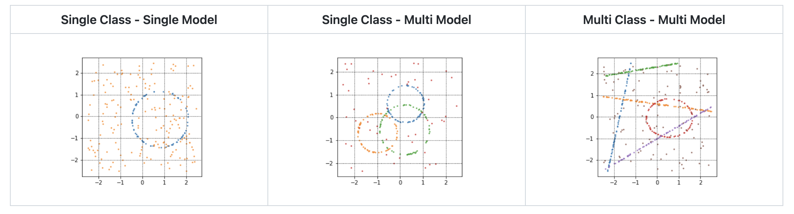

### High level overview

Sydraw (Synthetic Data Library) is a python library that helps you create synthetic 2D point clouds for single/multi-model single/multi-class tasks.  
Checkout the GitHub repository for a comprehensive description of its functionalities.

##### Supported Parametric Models
* Ellipses
* Circles
* Lines

##### Hyperparameters

* number and tipology of parametric models 
* number of total data points
* percentage of outliers (data points that do not belong to any model)
* percentage of noise corruption in each model

