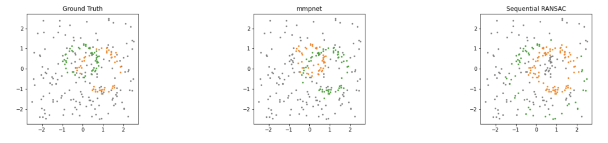
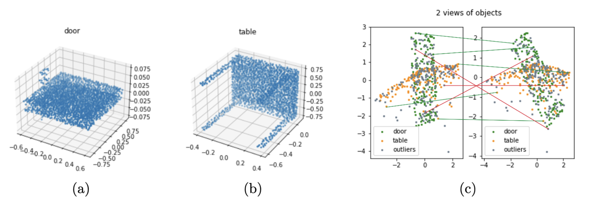
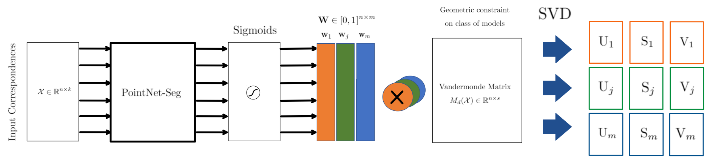

#### Authors
William Bonvini, supervised by Luca Magri & Giacomo Boracchi.

### High level overview

Multi-model fitting is the task of retrieving several parametric models in unstructured data possibly contaminated by noise and outliers. This problem arises in many Computer Vision applications like the estimation of planes and primitives in architectural imagery and the recovery of multiple geometric transformations from stereo images.  
In this work we propose a novel Deep Learning architecture for solving multi-model fitting problems in an unsupervised fashion, relying on a consensus maximization formulation.  
We compared the performance of our architecture with respect to the SOTA algorithm Sequential RANSAC: We obtained on par and superior performance when dealing with a limited number of parametric models (2 or 3).

*Comparison among our network (mmpnet) and Sequential RANSAC on 2 Circles
Fitting with 60% outliers and 9% noise*

### Rationale
Neural networks have not yet received a lot of attention for recovering structures in multi-model data, even though their potential in the single-model scenario has already been explored in the [Unsupervised Learning of Consensus Maximization for 3D Vision Problems](https://openaccess.thecvf.com/content_CVPR_2019/papers/Probst_Unsupervised_Learning_of_Consensus_Maximization_for_3D_Vision_Problems_CVPR_2019_paper.pdf) paper. The multi-model scenario is more challenging because data points belonging to one structure (inliers) constitute outliers of all the others.

### Dataset
##### 2D Dataset
We tested our network on fitting multiple lines or circles in 2D. 
The dataset was generated synthetically specifying a varying percentage of outliers and noise contamination.
##### 3D Dataset
We tested our network on fitting multiple homographies.
The dataset was generated using as starting point the 3D point clouds dataset ModelNet-40.   
We generated 2D views of randomly sampled point clouds and applied a rigid transformation to obtain point correspondences.

##### Example of pair of homography correspondences generated from Modelnet-40  

*(a) shows the 3D point cloud from which the first homography is obtained.*  
*(b) shows the 3D point cloud from which the second homography is obtained.*  
*(c) shows the generated matches.*   
*A match is to be intended as a pair of corresponding points in the 2D views. Inliers of the first homography are lines between two corresponding green points. Inliers of the second homography are lines between two corresponding orange points. Outliers are generated by randomly mixing correspondences, and are represented as lines between two grey points. For visualization purposes only a few inliers (green lines) and outliers (red lines) are shown.*

### Architecture

We relied on PointNet as our main building block. Point labels are already available after the *Sigmoids* step. The right-most part of the diagram is needed to compute the loss function.

*Pointnet outputs inlier scores \\(w_j\\) for each model \\(j \in  \{0, . . . , m\}\\). The Vandermonde matrix is weighted with each inlier score \\(w_j\\) to obtain the relative singular values \\(S_j\\)*

### Loss function

The loss function has been designed to maximize the point consensus to \\(m\\) models and favour solutions where there are no prediction intersections (points are not assigned to multiple models).

$$\begin{aligned}
\mathcal{L}(\theta,\mathcal{X}) &=  \color{teal}\sum_j^m\Bigg(-\lambda_{inliers}||\mathbf{w}_{\theta,j}(\mathcal{X})||_1+\lambda_{vander}\sum_{k=0}^{r-1}\sigma_{s-k}\big(\text{diag}(\mathbf{w}_{\theta,j}(\mathcal{X}))M(\mathcal{X})\big) \Bigg) \ \color{black}+  \\ \\ & \quad \color{brown}\lambda_{sim}\log(1+||\mathbf{\hat{W}_\theta}^T\mathbf{\hat{W}_\theta}-I||_2)  \ \color{black}+ \\ \\ & \quad \color{orange}\lambda_{var}\frac{\sum_{j}^m(||\mathbf{w}_{\theta,j}(\mathcal{X})||_1 -w_{avg})^2}{m}
\end{aligned}$$

* \\(\mathcal{X}=\text{input point cloud}\\)
* \\(m = \text{number of parametric models}\\)
* \\(n = \text{number of points in }\mathcal{X}\\)
* \\(\theta = \text{neural network's weights}\\)
* \\(\mathbf{W} \in [0, 1]^{n \times m}\\)
*  \\(\lambda_{inliers}, \lambda_{vander}, \lambda_{sim}, \lambda_{var} = \text{hyperparameters}\\). 
  
* \\(w_{avg}=\frac{\sum_j^m||\mathbf{w}_{\theta, j}(\mathcal{X})||_1)}{m} \\)

##### Terms description

$$\color{teal}\text{Consensus Maximization Term}$$

$$\color{brown}\text{Orthogonality Term}$$

$$\color{orange}\text{Inliers Count Balancing Term}$$

